# SQL Library Management System: Schema Design & Data Analysis

This project demonstrates the creation of a **Library Management System** using MySQL. It covers database schema design with strict constraints, table relationships, and complex data retrieval queries.

## Project Overview
The objective is to manage library operations efficiently by ensuring data integrity through Primary Keys, Foreign Keys, and Check constraints.

## Database Schema
The database `library_query_lab` consists of three tables:
- **MEMBER:** Stores member details with age validation (Age >= 12).
- **BOOK:** Tracks inventory, pricing, and availability status.
- **BORROW:** Manages the relationship between members and borrowed books.

## Key SQL Features Applied
- **Constraints:** `PRIMARY KEY`, `FOREIGN KEY`, `NOT NULL`, `UNIQUE`, `CHECK`, and `DEFAULT`.
- **Querying:** Pattern matching (`LIKE`), Range filtering (`BETWEEN`), and Set membership (`IN`).
- **Analytics:** Data aggregation (`COUNT`, `AVG`, `MIN/MAX`) and data grouping (`GROUP BY`).

---

## 📸 Implementation & Screenshots

### 1. Database & Table Creation
Defined the schema with all required constraints to ensure data reliability.
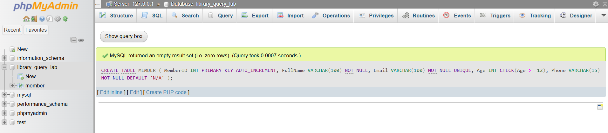.
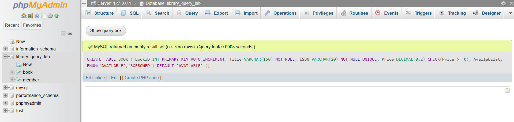.
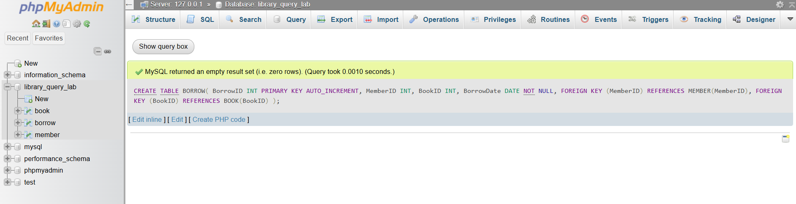.

### 2. Data Insert
Inserted 8 members, 8 books, and 10 borrow records to simulate a real-world dataset.
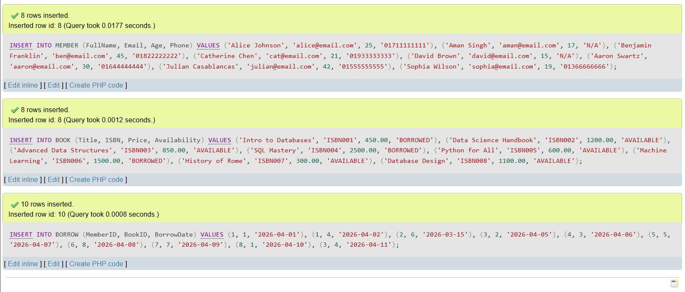

### 3. Data Retrieval & Analysis
Execution of various queries including sorting, filtering, and counting.

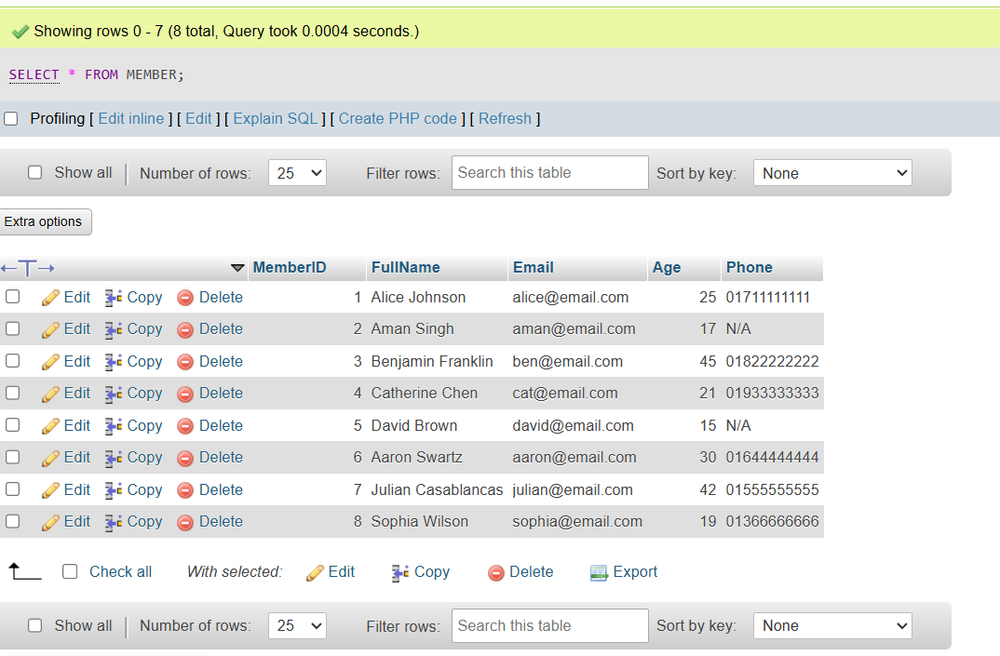
.png)
.png)
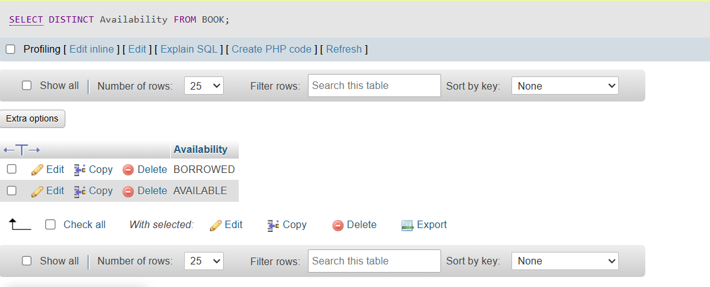
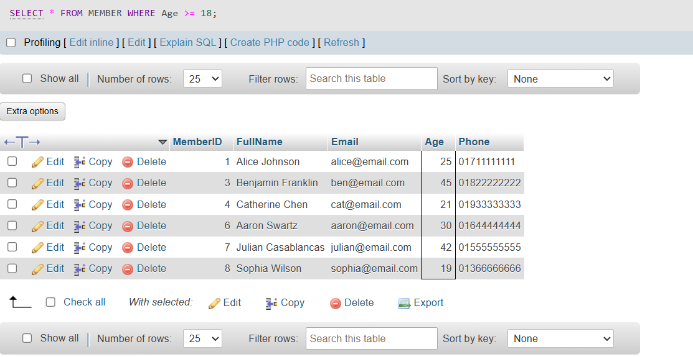
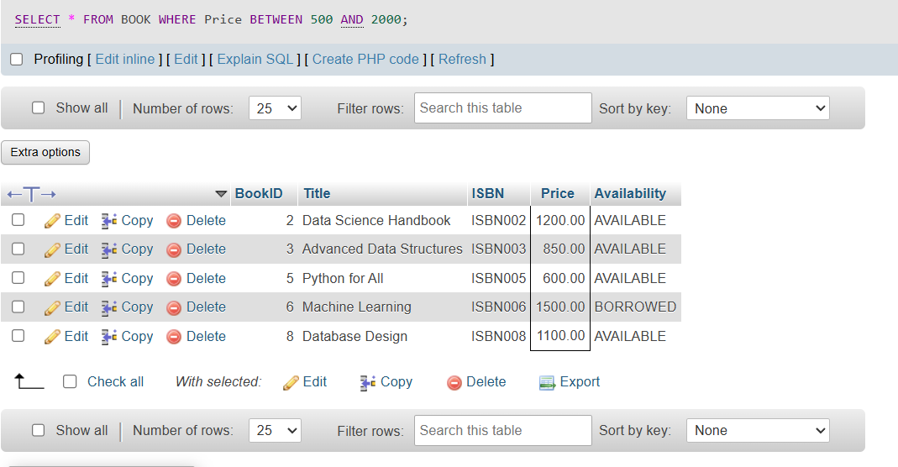
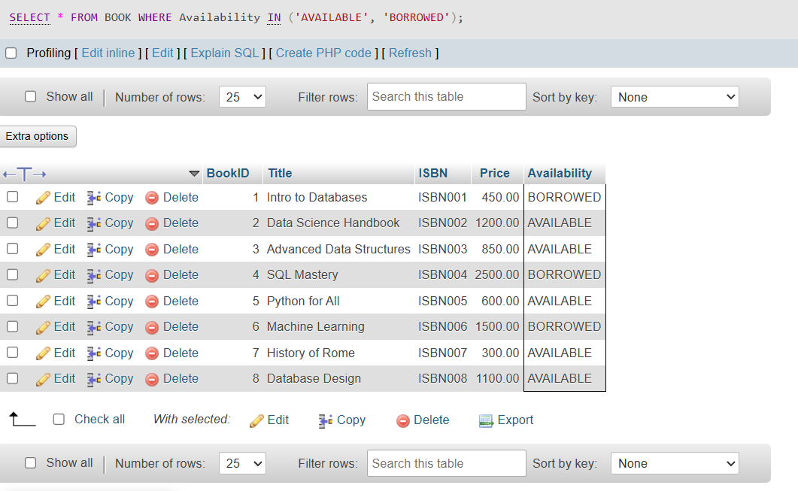
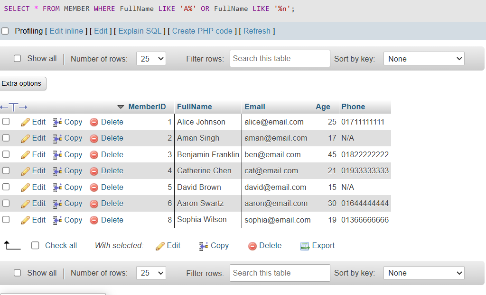
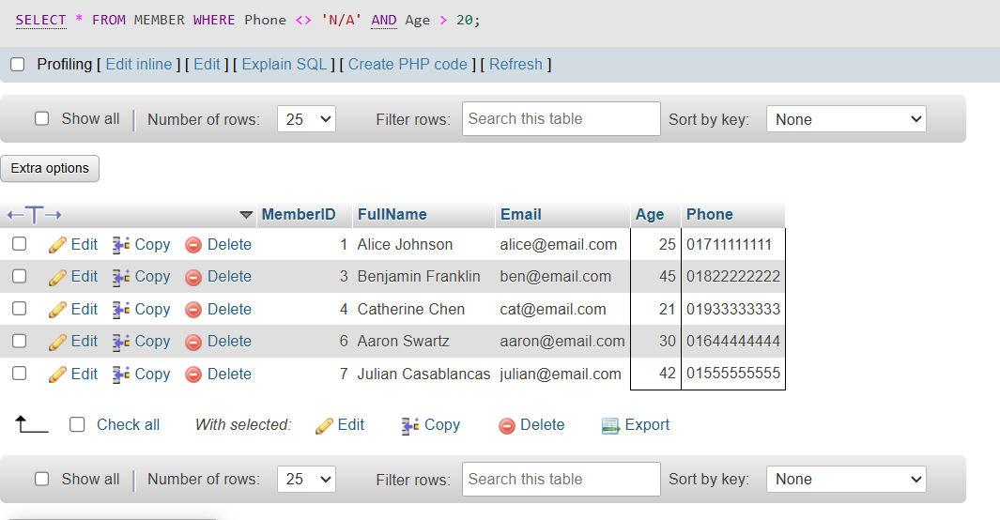
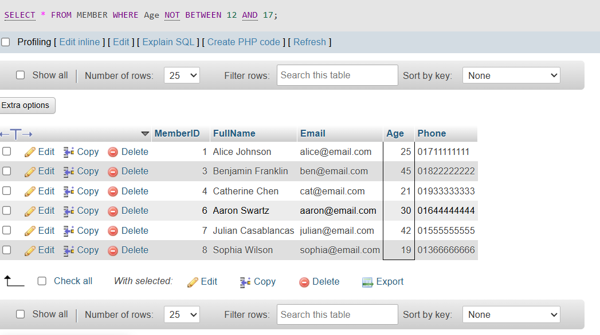
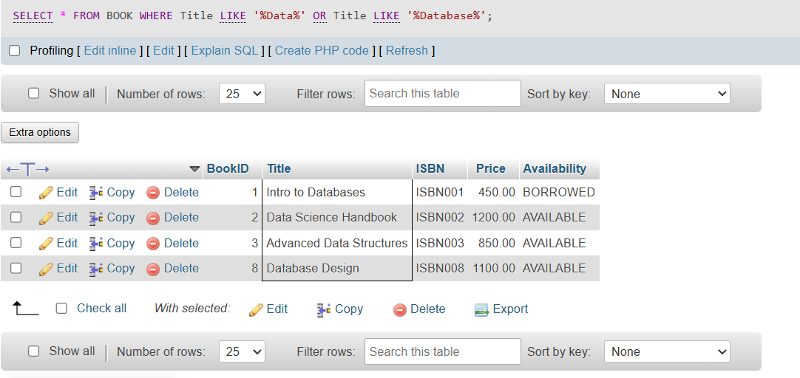
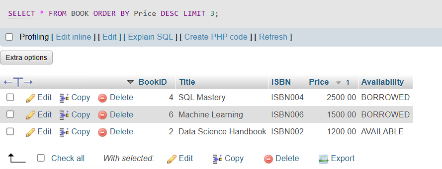
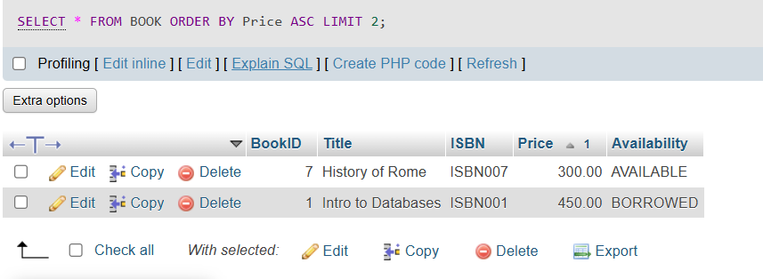
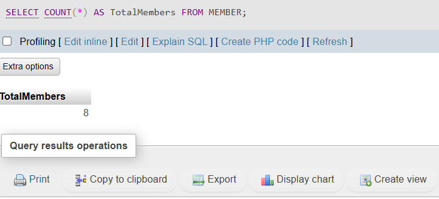
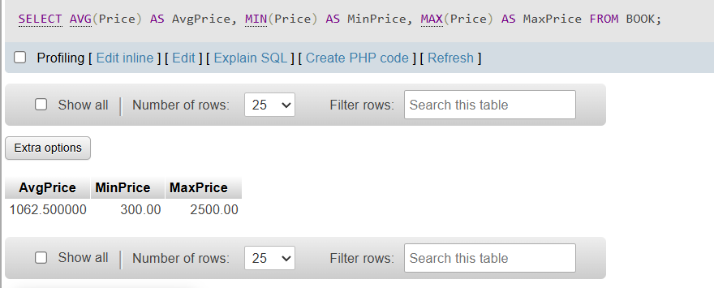
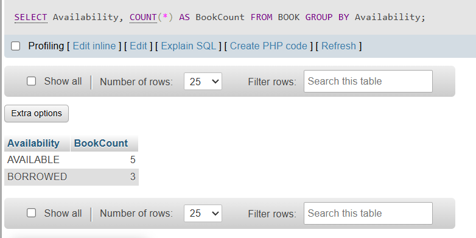
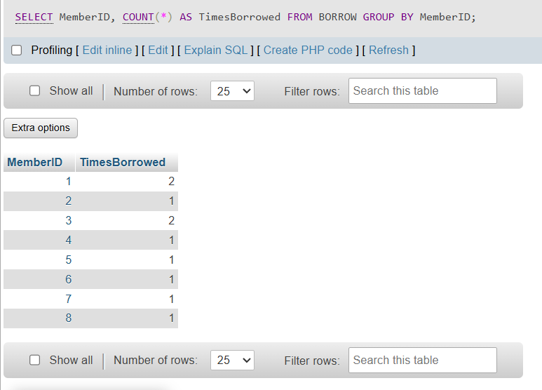

---

